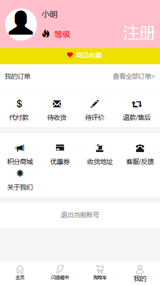
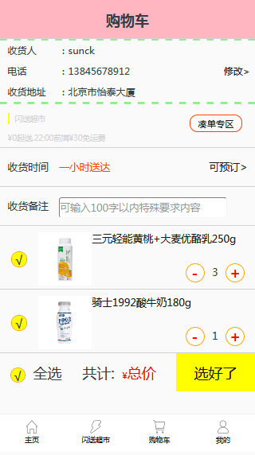

# django-shop

#### Mobile online mall  
#### 项目地址: http://online.silence321.com (测试账号:12345678 密码:123456)
#### 管理员后台地址: http://online.silence321.com/admin (账号:chen 密码:chen123456)

 

### 1、简介:移动端在线商城项目 django+python3.6+mysql+pycharm
### 2、主要实现功能：
#### 1,用户注册登录,会员中心

 
#### 2,商品分类展示,筛选,排序

 
#### 3,商品购物车,下订单

 
### 2、项目目录结构：

    +--manage.py
    +--online
    |      +--settings.py
    |      +--urls.py
    |      +--wsgi.py
    |      +--__init__.py
    +--shop
    |      +--admin.py
    |      +--apps.py
    |      +--migrations
    |      +--models.py
    |      +--tests.py
    |      +--urls.py
    |      +--views.py
    |      +--__init__.py
    +--static
    |      +--base
    |      +--cart
    |      +--main
    |      +--market
    |      +--mdeia
    |      +--mine
    +--templates
    |      +--home
    |      |      +--base.html
    |      |      +--cart.html
    |      |      +--login.html
    |      |      +--main.html
    |      |      +--market.html
    |      |      +--mine.html
    |      |      +--register.html
